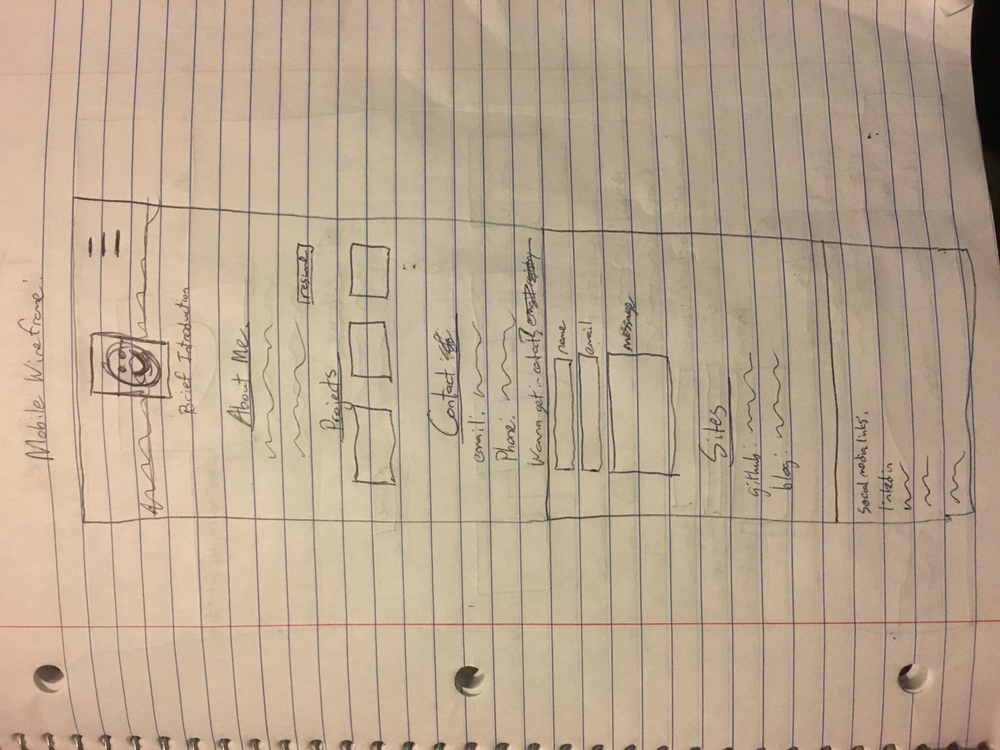
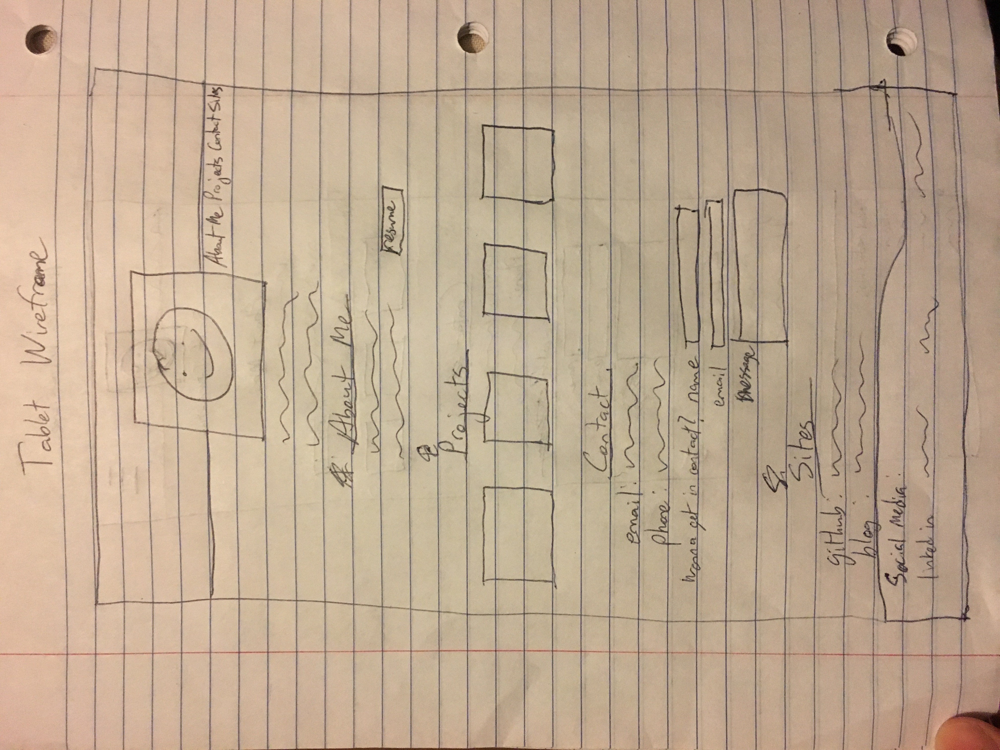
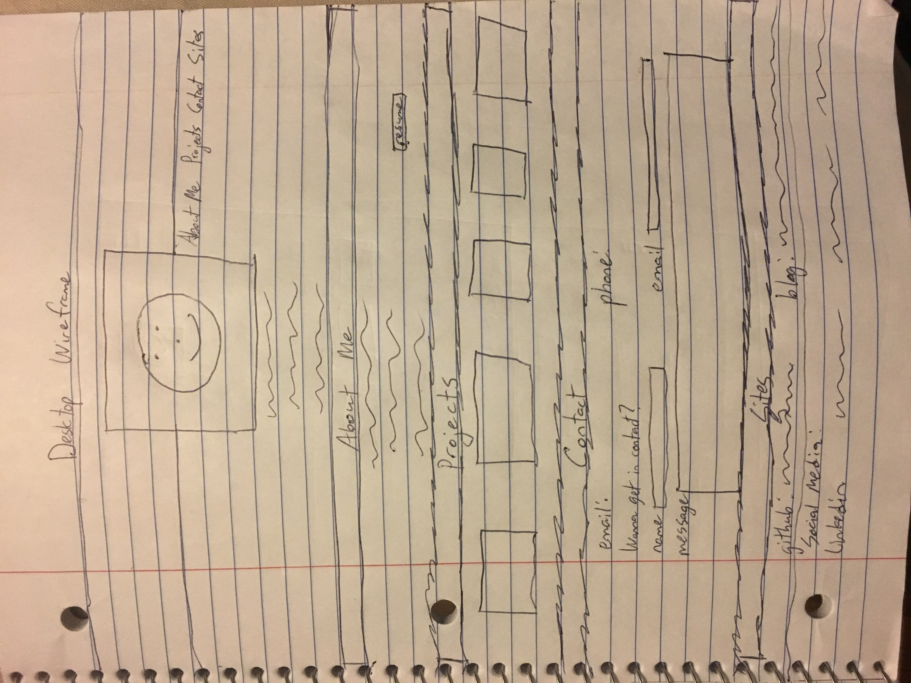
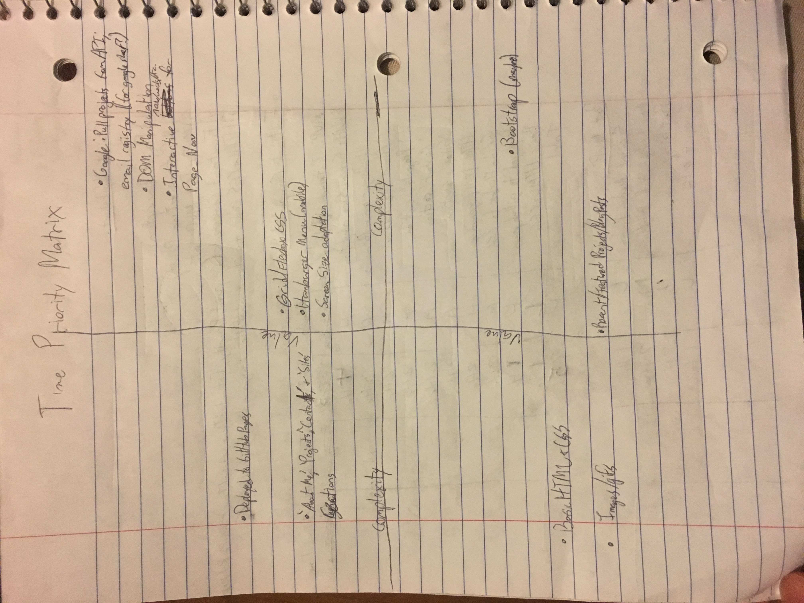

Brandon Balkaransingh
Project Worksheet – Project One – Portfolio Site
SEI-pineapple

Project Description:
This will be a portfolio site that will showcase my skills, projects, qualifications, and other information that employers and clients can use to make hiring decisions about me. I will include an About Me section, Projects section, Contact section, a section for links such as to my blog and to GitHub, an email registry, and a brief introduction section that includes a profile pic. For now, I will keep everything on one page as I want to keep this as simple as possible, and use the menu items to navigate to the appropriate section on the page. I shall be taking a mobile-first approach to building this site, meaning that I will design my site for a mobile device first, then scale it up to desktop and tablet devices using media queries. I will be using pages from the previous SEI students for inspiration as far as how I want my portfolio to look and function. I’ll put more information on that at a later point as I iron out the kinks.

Project link: 
GitHub Repo: https://github.com/bbalkaransingh23888/Project_1_Portfolio
I should be on line 17 on the Google sheet

Wireframe:
Mobile Wireframe: 
 

Tablet Wireframe: 
 

Desktop Wireframe: 
 

Time-Priority Index: 
 
MVP list:
1)	Interactive Buttons to navigate the page
2)	Display adaptation for different screen sizes (mobile, tablet, and desktop views); Hamburger menu for the mobile display
3)	‘About Me’, ‘Projects’, ‘Contact’, and ‘Sites’ section in addition to brief introduction page
4)	Program the HTML to be loaded in via the DOM??
5)	Flexbox and Grid for CSS
6)	‘About Me’ includes info. about who I am, work I’ve done, background, hobbies, etc.
7)	‘Projects’ section includes links to the projects as well as a small preview window thing…whatever that’s called
8)	‘Contact’ section includes my contact information, particularly my email and cell. It would include work contact info. in the future. I would also look to include an email registry here. 
9)	‘Sites’ include links to GitHub (personal and professional) and my personal Blog.
10)	 Deploy this site to my personal GitHub Pages account once this is complete.
11)	 Link the email registry to Google sheet?; be able to pull in projects via API call from Google sheet?

Post-MVP: 
1)	Social Media links: Can go in one or both of the contact section or the footer
2)	For ‘Projects’ section, make sure to include most recent and/or highlights. Also indicate complete (more or less) and ongoing projects
3)	Create a personal blog on my site -> utilize similar to post-MVP for ‘Projects’ section
4)	Bootstrap (maybe) 

Functional Components: 

MVP:

|Component|Priority|Est. Time|Time Invested|Actual Time|
|---------|--------|---------|-------------|-----------|
|Interactive words/menu items/etc. for page navigation|High|3 Hrs.|x|x| 		
|Mobile first approach with screen size adaptation|HIGH|4 Hrs.|x|x| 		
|Hamburger menu for mobile|High|3 Hrs.|x|x| 		
|‘About Me’|Medium|2 Hrs.|x|x| 		
|‘Projects’|Medium|2 Hrs.|x|x|		
|‘Contact’|Medium|2 Hrs.|x|x|		
|‘Sites’|Medium|2 Hrs.|x|x| 		
|Google Pull Projects from API and email registry for google sheet|HIGH|4 Hrs.|x|x|		
|DOM programming|High|3 Hrs.|x|x|		
|Grid & Flexbox for CSS|Medium|2 Hrs.|x|x|		
|Deployed to GitHub Pages|Low|1 Hr.|x|x|		
|Basic HTML & CSS|Low|1 Hr.|x|x|		
|TOTAL|High|29 HRs.|x|x| 		

Post-MVP:

|Component|Difficulty|Est. Time|Time Invested|Actual Time|
|---------|--------------------|---------|-------------|-----------|
|Social Media Links, Images, & Gifs|Low|1 Hr.|x|x|
<<<<<<< HEAD
|Indicate New/Featured Projects and Blogs -> Ongoing Projects|Medium|2 Hrs.|x|x|
|Bootstrap|HIGH(have to learn it)|4Hrs.|x|x|
=======
|Indicate New/Featured Projects and Blogs -> Ongoing Projects|Medium|2 Hrs.|x|x||Bootstrap(maybe)|HIGH|4 Hrs.|x|x|
|Bootstrap|HIGH(have to learn it)|4Hrs.|x|x|

>>>>>>> 3cf4426f727cfe31fcff310f9ce784e50f93c2ba
